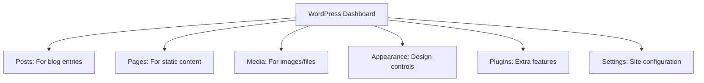
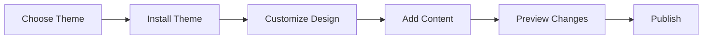

# Building Your First WordPress Website

## Table of Contents

1. [Introduction](#introduction)
2. [Getting Started](#getting-started)
3. [Understanding Your WordPress Dashboard](#understanding-your-wordpress-dashboard)
4. [Creating Your First Pages](#1-creating-your-first-pages)
   - [Understanding Blocks](#understanding-blocks)
   - [Important Page Elements](#important-page-elements)
5. [Working with Media](#2-working-with-media)
   - [Adding Images](#adding-images)
   - [Image Best Practices](#image-best-practices)
6. [Choosing and Customizing Your Theme](#3-choosing-and-customizing-your-theme)
   - [Finding a Theme](#finding-a-theme)
   - [Customizing Your Theme](#customizing-your-theme)
7. [Essential Plugins](#4-essential-plugins)
   - [Security Plugins](#security-plugins)
   - [SEO Plugins](#seo-plugins)
   - [Contact Form Plugins](#contact-form-plugins)
8. [Creating an Effective Homepage](#5-creating-an-effective-homepage)
   - [Essential Homepage Elements](#essential-homepage-elements)
   - [Creating a Navigation Menu](#creating-a-navigation-menu)
9. [Creating Custom Shortcodes](#6-creating-custom-shortcodes)
   - [Understanding Shortcodes](#understanding-shortcodes)
   - [Creating a More Complex Shortcode](#creating-a-more-complex-shortcode)
   - [Shortcode Best Practices](#shortcode-best-practices)
10. [Creating Custom Blocks](#7-creating-custom-blocks)
    - [Your First Custom Block](#your-first-custom-block)
    - [Understanding Custom Blocks](#understanding-custom-blocks)
11. [Common Problems and Solutions](#common-problems-and-solutions)
12. [Best Practices for Beginners](#best-practices-for-beginners)
13. [Resources for Learning More](#resources-for-learning-more)

## Introduction

WordPress is a popular content management system that helps you create and manage websites without needing advanced technical knowledge. This guide will walk you through creating your first WordPress website, explaining each step in detail.

## Getting Started

Before we begin, you'll need:
- A LAMP server with WordPress installed
- Access to your WordPress admin dashboard

## Understanding Your WordPress Dashboard

When you first log into WordPress, you'll see the dashboard - think of this as your website's control center. Let's understand what each part does:



## 1. Creating Your First Pages

Every website needs content. Let's start by creating some basic pages:

1. Find the "Pages" menu on the left sidebar
2. Click "Add New"
3. You'll see the Block Editor, which works like a modern document editor

### Understanding Blocks
Think of blocks as building blocks for your page - like Lego pieces. Each piece has a specific purpose:
- Paragraph blocks for text
- Image blocks for pictures
- Heading blocks for titles
- Button blocks for clickable buttons

To add a block:
1. Click the (+) button in the editor
2. Choose your desired block type
3. Start adding content

### Important Page Elements

Every good page should have:
- A clear heading (use the Heading block)
- Well-organized content (use Paragraph blocks)
- Visual elements (use Image blocks)
- A call to action (use Button blocks)

## 2. Working with Media

Modern websites use lots of images and videos. Here's how to manage them:

### Adding Images
1. Click "Media" in the dashboard
2. Select "Add New"
3. Either drag files or click "Select Files"

### Image Best Practices
- Use descriptive file names (good: "red-winter-coat.jpg", bad: "IMG12345.jpg")
- Fill in the "Alt Text" field to describe your image
- Compress images before uploading to keep your site fast

## 3. Choosing and Customizing Your Theme

Your theme controls how your website looks. Here's how to choose and customize one:



### Finding a Theme
1. Go to "Appearance" → "Themes"
2. Click "Add New"
3. Use filters to find themes that match your needs:
   - "Features" to find themes with specific capabilities
   - "Subject" to find themes for your type of website
   - "Layout" to find themes with your preferred design

### Customizing Your Theme
1. Go to "Appearance" → "Editor"
2. You can change:
   - Colors
   - Typography (fonts)
   - Layout options
   - Header and footer designs

## 4. Essential Plugins

Plugins add new features to your website. Here are some types of plugins you might need:

### Security Plugins
- Help protect your website from attacks
- Create automatic backups
- Scan for problems

### Contact Form Plugins
- Let visitors send you messages
- Collect information from users
- Protect against spam

To install a plugin:
1. Go to "Plugins" → "Add New"
2. Search for the type of plugin you need
3. Read reviews and check the rating
4. Click "Install Now" then "Activate"

## 5. Creating an Effective Homepage

Your homepage is often the first thing visitors see. Let's create an engaging one:

### Essential Homepage Elements
1. Clear navigation menu
2. Compelling headline
3. Clear description of your website's purpose
4. Call-to-action buttons
5. Contact information

### Creating a Navigation Menu
1. Go to "Appearance" → "Menus"
2. Create a new menu
3. Add your important pages
4. Set it as your "Primary Menu"

## 6. Creating Custom Shortcodes

Shortcodes are like special commands that you can use in your pages or posts to add unique features. Let's explore how to create and use them effectively.

### Understanding Shortcodes

Think of shortcodes as shortcuts that tell WordPress to do something special at a specific spot. For example, if you want to add the current year to your website automatically, you can create a simple shortcode:

```php
// This code goes in your theme's functions.php file
function display_current_year() {
    // Get the current year
    $year = date('Y');
    // Return it (don't echo/print it!)
    return $year;
}
// Tell WordPress about our new shortcode
add_shortcode('current_year', 'display_current_year');
```

Now you can use `[current_year]` anywhere in your content, and WordPress will automatically insert the current year.

### Creating a More Complex Shortcode

Let's create a more useful shortcode that displays nicely formatted quotes. This example shows how to work with attributes (extra information we can pass to our shortcode):

```php
function custom_quote_shortcode($attributes, $content = null) {
    // Set default values for our attributes
    $args = shortcode_atts(array(
        'author' => 'Unknown', // Default author if none provided
        'color' => 'blue'      // Default color if none provided
    ), $attributes);
    
    // Create the HTML for our quote
    // The content parameter contains what's between the opening and closing shortcode
    $html = '<div class="custom-quote" style="border-left: 4px solid ' . esc_attr($args['color']) . ';">';
    $html .= '<p class="quote-text">' . esc_html($content) . '</p>';
    $html .= '<p class="quote-author">- ' . esc_html($args['author']) . '</p>';
    $html .= '</div>';
    
    return $html;
}
add_shortcode('quote', 'custom_quote_shortcode');
```

You can now create beautiful quotes in your content like this:
```
[quote author="Mark Twain" color="purple"]The secret of getting ahead is getting started.[/quote]
```

### Shortcode Best Practices

When creating shortcodes, remember these important guidelines:
1. Always return content, don't echo it
2. Use `esc_html()` and `esc_attr()` to make your shortcodes secure
3. Provide default values for all attributes
4. Keep shortcodes focused on a single purpose
5. Document how to use your shortcodes

## 7. Creating Custom Blocks

In modern WordPress, blocks are the preferred way to add special content to your pages. While shortcodes are simple commands, blocks provide a richer editing experience. Let's create a custom block together.

### Your First Custom Block

We'll create a "Highlighted Text" block that lets users add text with a colored background. Here's how:

First, set up your development environment:

```bash
# In your theme or plugin directory
npx @wordpress/create-block highlighted-text
```

Then, create your block's main code:

```jsx
import { registerBlockType } from '@wordpress/blocks';
import { useBlockProps, RichText, ColorPicker } from '@wordpress/block-editor';
import { Panel, PanelBody } from '@wordpress/components';
import { __ } from '@wordpress/i18n';

registerBlockType('my-plugin/highlighted-text', {
    // Tell WordPress about our block
    title: __('Highlighted Text', 'my-plugin'),
    icon: 'admin-customizer',
    category: 'text',
    
    // What data we need to save
    attributes: {
        content: {
            type: 'string',
            source: 'html',
            selector: 'p',
        },
        backgroundColor: {
            type: 'string',
            default: '#fff4cc'
        }
    },
    
    // What appears in the editor
    edit: function(props) {
        const { attributes, setAttributes } = props;
        const blockProps = useBlockProps();
        
        return (
            <div {...blockProps}>
                {/* The text input */}
                <RichText
                    tagName="p"
                    value={attributes.content}
                    onChange={(content) => setAttributes({ content })}
                    placeholder={__('Add highlighted text...', 'my-plugin')}
                    style={{ backgroundColor: attributes.backgroundColor }}
                />
                
                {/* Color picker in the sidebar */}
                <Panel>
                    <PanelBody title={__('Color Settings', 'my-plugin')}>
                        <ColorPicker
                            color={attributes.backgroundColor}
                            onChangeComplete={(color) => 
                                setAttributes({ backgroundColor: color.hex })
                            }
                        />
                    </PanelBody>
                </Panel>
            </div>
        );
    },
    
    // How to save the content
    save: function(props) {
        const blockProps = useBlockProps.save();
        return (
            <div {...blockProps}>
                <RichText.Content
                    tagName="p"
                    value={props.attributes.content}
                    style={{ backgroundColor: props.attributes.backgroundColor }}
                />
            </div>
        );
    }
});
```

### Understanding Custom Blocks

A block consists of three main parts, each serving a specific purpose:

1. Registration: This tells WordPress about your block - what it's called, what icon to use, and what category it belongs in.

2. Edit Component: This defines what users see in the editor. Think of it as the interface where users input their content. In our example, it includes a text input area and a color picker.

3. Save Component: This determines how the content is stored and displayed on the actual website. It takes the content from the editor and formats it for display.

Think of it like building a form:
- Registration is like creating the form fields and labels
- Edit is like designing the form's appearance and interaction
- Save is like processing the form submission and displaying the results

## Common Problems and Solutions

### If Your Site Looks Different From the Preview
- Clear your browser cache
- Try a different browser
- Check if all plugins are active

### If Your Site Is Loading Slowly
- Optimize your images
- Remove unused plugins
- Check with your hosting provider

### If You Can't Log In
- Clear your browser cookies
- Try the password reset link
- Contact your hosting provider

## Best Practices for Beginners

1. Always keep backups of your site
2. Update WordPress and plugins regularly
3. Don't install too many plugins
4. Test changes before making them live
5. Keep your login credentials secure

## Resources for Learning More

- WordPress Documentation: The official guide for learning more
- WordPress Forums: Where you can ask questions
- Theme Documentation: Specific guides for your theme

Remember: Start small and gradually add more features as you become comfortable with the basics. It's better to have a simple, working website than a complex one that doesn't work properly.
