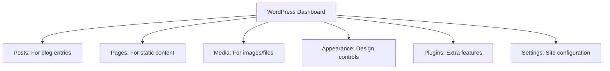
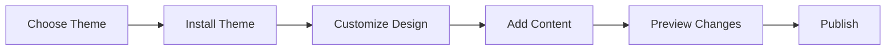

# Building Your First WordPress Website

## Introduction

WordPress is a popular content management system that helps you create and manage websites without needing advanced technical knowledge. This guide will walk you through creating your first WordPress website, explaining each step in detail.

## Getting Started

Before we begin, you'll need:
- A web hosting account with WordPress support
- A domain name
- Access to your WordPress admin dashboard

## Understanding Your WordPress Dashboard

When you first log into WordPress, you'll see the dashboard - think of this as your website's control center. Let's understand what each part does:

## 1. Creating Your First Pages

Every website needs content. Let's start by creating some basic pages:

1. Find the "Pages" menu on the left sidebar
2. Click "Add New"
3. You'll see the Block Editor, which works like a modern document editor

### Understanding Blocks
Think of blocks as building blocks for your page - like Lego pieces. Each piece has a specific purpose:
- Paragraph blocks for text
- Image blocks for pictures
- Heading blocks for titles
- Button blocks for clickable buttons

To add a block:
1. Click the (+) button in the editor
2. Choose your desired block type
3. Start adding content

### Important Page Elements

Every good page should have:
- A clear heading (use the Heading block)
- Well-organized content (use Paragraph blocks)
- Visual elements (use Image blocks)
- A call to action (use Button blocks)

## 2. Working with Media

Modern websites use lots of images and videos. Here's how to manage them:

### Adding Images
1. Click "Media" in the dashboard
2. Select "Add New"
3. Either drag files or click "Select Files"

### Image Best Practices
- Use descriptive file names (good: "red-winter-coat.jpg", bad: "IMG12345.jpg")
- Fill in the "Alt Text" field to describe your image
- Compress images before uploading to keep your site fast

## 3. Choosing and Customizing Your Theme

Your theme controls how your website looks. Here's how to choose and customize one:

### Finding a Theme
1. Go to "Appearance" → "Themes"
2. Click "Add New"
3. Use filters to find themes that match your needs:
   - "Features" to find themes with specific capabilities
   - "Subject" to find themes for your type of website
   - "Layout" to find themes with your preferred design

### Customizing Your Theme
1. Go to "Appearance" → "Editor"
2. You can change:
   - Colors
   - Typography (fonts)
   - Layout options
   - Header and footer designs

## 4. Essential Plugins

Plugins add new features to your website. Here are some types of plugins you might need:

### Security Plugins
- Help protect your website from attacks
- Create automatic backups
- Scan for problems

### SEO Plugins
- Help search engines find your content
- Improve your search rankings
- Guide you in writing better content

### Contact Form Plugins
- Let visitors send you messages
- Collect information from users
- Protect against spam

To install a plugin:
1. Go to "Plugins" → "Add New"
2. Search for the type of plugin you need
3. Read reviews and check the rating
4. Click "Install Now" then "Activate"

## 5. Creating an Effective Homepage

Your homepage is often the first thing visitors see. Let's create an engaging one:

### Essential Homepage Elements
1. Clear navigation menu
2. Compelling headline
3. Clear description of your website's purpose
4. Call-to-action buttons
5. Contact information

### Creating a Navigation Menu
1. Go to "Appearance" → "Menus"
2. Create a new menu
3. Add your important pages
4. Set it as your "Primary Menu"

## 6. Making Your Site Mobile-Friendly

Most people will visit your site on phones and tablets. Here's how to make sure it works well for them:

### Mobile-Friendly Tips
1. Preview your site on different devices
2. Use the "Mobile Preview" button in the editor
3. Make sure text is large enough to read
4. Ensure buttons are big enough to tap
5. Test your menu works on small screens

## 7. Basic SEO and Site Visibility

Help people find your website:

### Simple SEO Steps
1. Write clear page titles
2. Add descriptions to all pages
3. Use headings properly (H1, H2, H3)
4. Name images descriptively
5. Create quality content regularly

## Common Problems and Solutions

### If Your Site Looks Different From the Preview
- Clear your browser cache
- Try a different browser
- Check if all plugins are active

### If Your Site Is Loading Slowly
- Optimize your images
- Remove unused plugins
- Check with your hosting provider

### If You Can't Log In
- Clear your browser cookies
- Try the password reset link
- Contact your hosting provider

## Best Practices for Beginners

1. Always keep backups of your site
2. Update WordPress and plugins regularly
3. Don't install too many plugins
4. Test changes before making them live
5. Keep your login credentials secure

## Resources for Learning More

- WordPress Documentation: The official guide for learning more
- WordPress Forums: Where you can ask questions
- Theme Documentation: Specific guides for your theme

Remember: Start small and gradually add more features as you become comfortable with the basics. It's better to have a simple, working website than a complex one that doesn't work properly.
