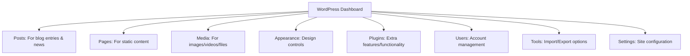
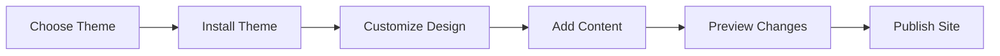

# Building Your First WordPress Website

## Table of Contents

1. [Introduction](#introduction)
2. [Getting Started](#getting-started)
3. [Understanding Your WordPress Dashboard](#understanding-your-wordpress-dashboard)
4. [Creating Your First Pages](#4-creating-your-first-pages)
   - [Understanding Blocks](#understanding-blocks)
   - [Important Page Elements](#important-page-elements)
5. [Working with Media](#5-working-with-media)
   - [Adding Images](#adding-images)
   - [Image Best Practices](#image-best-practices)
6. [Choosing and Customizing Your Theme](#6-choosing-and-customizing-your-theme)
   - [Finding a Theme](#finding-a-theme)
   - [Full Site Editing](#full-site-editing)
   - [Customizing Your Theme](#customizing-your-theme)
7. [Essential Plugins](#7-essential-plugins)
   - [Security Plugins](#security-plugins)
   - [SEO Plugins](#seo-plugins)
   - [Performance Plugins](#performance-plugins)
   - [Contact Form Plugins](#contact-form-plugins)
8. [Creating an Effective Homepage](#8-creating-an-effective-homepage)
   - [Essential Homepage Elements](#essential-homepage-elements)
   - [Creating a Navigation Menu](#creating-a-navigation-menu)
9. [Creating Custom Blocks](#9-creating-custom-blocks)
    - [Your First Custom Block](#your-first-custom-block)
    - [Understanding Custom Blocks](#understanding-custom-blocks)
    - [Using Reusable Blocks](#using-reusable-blocks)
10. [Mobile Optimization](#10-mobile-optimization)
11. [Common Problems and Solutions](#common-problems-and-solutions)
12. [Best Practices for Beginners](#best-practices-for-beginners)
13. [Resources for Learning More](#resources-for-learning-more)

## 1. Introduction

WordPress powers over 40% of all websites on the internet, making it the most popular content management system (CMS) in the world. As a college student, learning WordPress gives you valuable skills that can enhance your personal projects, academic work, and future career opportunities. Whether you're building a portfolio, a blog, or a business site, WordPress provides the tools you need without requiring advanced coding knowledge.

This guide will walk you through creating your first WordPress website, explaining each step in simple terms while introducing you to the powerful features of the latest WordPress version.

## 2. Getting Started

Before we begin, you'll need:
- A domain name (your website address)
- Web hosting with WordPress installed (many hosts offer one-click WordPress installation)
- Access to your WordPress admin dashboard

**Quick Start Option**: For this class, you may be using a pre-configured LAMP server with WordPress already installed. If so, your instructor will provide login details.

## 3. Understanding Your WordPress Dashboard

When you first log into WordPress at `yourdomain.com/wp-admin`, you'll see the dashboard - think of this as your website's control center. Here's a breakdown of the key elements:



**Pro Tip**: The left sidebar navigation is your main menu for accessing all WordPress features. The dashboard can be customized by clicking "Screen Options" at the top-right corner.

## 4. Creating Your First Pages

Every website needs core content pages. Let's start by creating some essential pages:

1. Click on "Pages" in the left sidebar
2. Select "Add New"
3. You'll now see the Block Editor (also called Gutenberg), WordPress's modern content editor

### Understanding Blocks

WordPress uses a "block-based" editing system, which is a fundamental concept to understand:


Think of blocks as content modules that you can add, arrange, and customize:

- **Paragraph Block**: For regular text content
- **Heading Block**: For section titles (H1, H2, H3, etc.)
- **Image Block**: For adding pictures
- **Gallery Block**: For multiple images
- **Button Block**: For call-to-action buttons
- **Video Block**: For embedding videos
- **Column Block**: For multi-column layouts
- **Group Block**: For combining multiple blocks together

To add a new block:
1. Click the "+" icon either in the top-left corner or where you want to insert a block
2. Select your desired block from the menu, or type "/" followed by the block name
3. Begin adding content to your block

**Try this**: Create a new page called "About" with a heading block, paragraph block, and an image block.

### Important Page Elements

For effective pages, include these key components:

- **Clear Hierarchy**: Use heading blocks (H2, H3, etc.) to structure your content
- **Scannable Content**: Break text into short paragraphs with subheadings
- **Visual Elements**: Add relevant images to illustrate your points
- **Call to Action**: Include buttons or links that guide visitors to take action

## 5. Working with Media

Visual content is crucial for engaging websites. Here's how to manage your media effectively:

### Adding Images

1. Click "Media" → "Add New" in the dashboard, or
2. Add an image block directly in your page/post and upload from there

WordPress automatically creates different sizes of each uploaded image to optimize for various screen sizes.

### Image Best Practices

- **File Format**: Use JPG for photographs, PNG for graphics with transparency, WebP for best compression
- **Image Size**: Resize large images before uploading (2000px max width is typically sufficient)
- **File Names**: Use descriptive file names with keywords (e.g., "student-project-portfolio.jpg")
- **Alt Text**: Always add alternative text describing the image for accessibility and SEO
- **Compression**: Use tools like TinyPNG or Squoosh to compress images before uploading

**Media Organization Tip**: Create a system for organizing your media library. Consider naming conventions like "project-type-description.jpg" for easy searching later.

## 6. Choosing and Customizing Your Theme

Your theme determines your website's appearance and layout. WordPress themes have evolved significantly with the introduction of Full Site Editing (FSE).



### Finding a Theme

1. Go to "Appearance" → "Themes"
2. Click "Add New"
3. Browse themes or use filters:
   - Search for "FSE" or "Block Theme" for the newest full-site editing themes
   - Use "Feature Filter" to find themes with specific capabilities
   - Check "Popular" or "Latest" tabs for trending options

**Theme Selection Tip**: Look for themes that are:
- Regularly updated
- Well-rated (4+ stars)
- Compatible with the latest WordPress version
- Responsive (mobile-friendly)
- Lightweight and fast-loading

### Full Site Editing

Modern WordPress uses Full Site Editing (FSE) with block themes, allowing you to customize your entire site using blocks - not just individual pages:

1. Go to "Appearance" → "Editor" (Site Editor)
2. Here you can edit:
   - Templates (how different page types look)
   - Template parts (headers, footers, etc.)
   - Styles (colors, typography, spacing)

### Customizing Your Theme

For both traditional and block themes:

1. Go to "Appearance" → "Customize" (traditional themes) or "Editor" (block themes)
2. You can modify:
   - Site identity (logo, title, tagline)
   - Colors and background
   - Typography (fonts and text sizes)
   - Header and footer layouts
   - Menu structures
   - Widget areas

**Start Simple**: Begin with the provided templates and gradually make changes as you become more comfortable with WordPress.

## 7. Essential Plugins

Plugins extend WordPress functionality. Think of them as apps for your website. Here are essential categories:

### Media Management Plugins

Enhance your media library capabilities:
- **Envira Gallery** or **NextGEN Gallery**: For creating beautiful image galleries
- **Media Library Assistant**: For better organization of uploaded files
- **FileBird**: For creating folders to organize your media library

### Learning Management Plugins

Perfect for educational projects:
- **LearnDash** or **TutorLMS**: For creating online courses
- **LearnPress**: Free solution for building education websites
- **H5P**: For creating interactive content and quizzes

### Performance Plugins

Keep your site fast and responsive:
- **WP Rocket** or **W3 Total Cache**: For page caching and speed optimization
- **Smush** or **ShortPixel**: For image optimization

### Contact Form Plugins

Allow visitors to reach you:
- **WPForms Lite** or **Contact Form 7**: For creating contact forms
- **Forminator**: For more advanced forms and polls

**Installing Plugins**:
1. Go to "Plugins" → "Add New"
2. Search for the desired plugin
3. Click "Install Now" then "Activate"

**Plugin Warning**: Only install plugins you actually need. Too many plugins can slow down your site and create security vulnerabilities.

## 8. Creating an Effective Homepage

Your homepage is your website's front door. Make it count!

### Essential Homepage Elements

An effective homepage typically includes:

1. **Hero Section**: A prominent area with your main message and call to action
2. **Value Proposition**: Clearly explain what your site offers visitors
3. **Featured Content**: Highlight your best work or most important information
4. **Social Proof**: Testimonials, reviews, or client logos if applicable
5. **Clear Navigation**: Help visitors find what they're looking for quickly
6. **Contact Information**: Make it easy for people to reach you

### Creating a Navigation Menu

Create an intuitive navigation structure:

1. Go to "Appearance" → "Menus"
2. Create a new menu by clicking "create a new menu"
3. Add pages from the left panel
4. Arrange them by dragging and dropping
5. Under "Menu Settings," assign it as your "Primary Menu"
6. Consider using dropdown menus (parent/child pages) for organizing related content

**Navigation Tips**:
- Keep your main menu to 5-7 items maximum
- Use clear, descriptive labels
- Put your most important pages first or in the middle (people remember the first and last items best)

## 9. Creating Custom Blocks

While shortcodes were the old way to add custom elements, blocks are the modern WordPress approach. Let's explore working with blocks:

### Your First Custom Block

We'll create a simple "Highlighted Text" block. This is advanced functionality that requires some development knowledge:

1. First, set up your development environment (you'd typically do this in a custom plugin):

```bash
# Create a custom block plugin structure
npx @wordpress/create-block highlighted-text
```

2. Create your block's main code:

```jsx
import { registerBlockType } from '@wordpress/blocks';
import { useBlockProps, RichText, InspectorControls } from '@wordpress/block-editor';
import { PanelBody, ColorPicker } from '@wordpress/components';
import { __ } from '@wordpress/i18n';

registerBlockType('my-plugin/highlighted-text', {
    title: __('Highlighted Text', 'my-plugin'),
    icon: 'admin-customizer',
    category: 'text',
    
    attributes: {
        content: {
            type: 'string',
            source: 'html',
            selector: 'p',
        },
        backgroundColor: {
            type: 'string',
            default: '#fff4cc'
        }
    },
    
    edit: function(props) {
        const { attributes, setAttributes } = props;
        const blockProps = useBlockProps();
        
        return (
            <>
                <InspectorControls>
                    <PanelBody title={__('Color Settings', 'my-plugin')}>
                        <ColorPicker
                            color={attributes.backgroundColor}
                            onChangeComplete={(color) => 
                                setAttributes({ backgroundColor: color.hex })
                            }
                            disableAlpha
                        />
                    </PanelBody>
                </InspectorControls>
                
                <div {...blockProps}>
                    <RichText
                        tagName="p"
                        value={attributes.content}
                        onChange={(content) => setAttributes({ content })}
                        placeholder={__('Add highlighted text...', 'my-plugin')}
                        style={{ backgroundColor: attributes.backgroundColor, padding: '10px' }}
                    />
                </div>
            </>
        );
    },
    
    save: function(props) {
        const blockProps = useBlockProps.save();
        return (
            <div {...blockProps}>
                <RichText.Content
                    tagName="p"
                    value={props.attributes.content}
                    style={{ backgroundColor: props.attributes.backgroundColor, padding: '10px' }}
                />
            </div>
        );
    }
});
```

### Understanding Custom Blocks

Custom blocks consist of three main parts:

1. **Registration**: Defining the block's attributes, name, and category
2. **Edit Component**: The block's appearance and behavior in the editor
3. **Save Component**: How the block is saved and displayed on the frontend

### Using Reusable Blocks

For a simpler approach, WordPress includes "Reusable Blocks" that don't require coding:

1. Create any combination of blocks you want to reuse
2. Select all the blocks
3. Click the three dots in the toolbar and select "Add to Reusable blocks"
4. Name your reusable block
5. Now you can insert this block anywhere using the block inserter

**Reusable Block Tip**: Use reusable blocks for content that appears on multiple pages, like call-to-action sections or contact information.

## 10. Mobile Optimization

With most web traffic coming from mobile devices, your site must work well on phones and tablets:

1. **Use Responsive Themes**: Modern WordPress themes are responsive by default
2. **Test Mobile Experience**: Use Chrome DevTools (F12) to preview mobile layouts
3. **Optimize Touch Targets**: Ensure buttons and links are large enough to tap (min. 44×44 pixels)
4. **Check Font Sizes**: Text should be readable without zooming (16px minimum)
5. **Simplify Navigation**: Consider a hamburger menu for mobile views
6. **Optimize Images**: Large images slow down mobile loading

## 11. Common Problems and Solutions

### If Your Site Looks Different From the Preview
- Clear your browser cache (Ctrl+Shift+R or Cmd+Shift+R)
- Try a different browser
- Check if your theme is fully activated
- Ensure all required plugins are active

### If Your Site Is Loading Slowly
- Optimize images before uploading
- Install a caching plugin
- Remove or replace resource-heavy plugins
- Update to the latest PHP version
- Consider better hosting

### If the Block Editor Isn't Working Properly
- Disable plugins one by one to identify conflicts
- Clear browser cache and cookies
- Try switching to a default WordPress theme temporarily

### If You Can't Log In
- Clear browser cookies
- Use the password reset link
- Check your database connection
- Try accessing WordPress in incognito/private mode

## 12. Best Practices for Beginners

1. **Start Simple**: Begin with a basic site structure and add features gradually
2. **Make Regular Backups**: Use plugins like UpdraftPlus or your host's backup system
3. **Update Regularly**: Keep WordPress core, themes, and plugins updated for security
4. **Limit Plugins**: Only install what you truly need
5. **Use Strong Passwords**: For all admin accounts
6. **Optimize Images**: Compress images before uploading
7. **Create a Staging Site**: Test changes before applying them to your live site
8. **Learn Keyboard Shortcuts**: Press Shift+Alt+H in the editor to see block shortcuts

## 13. Resources for Learning More

- [WordPress.org Documentation](https://wordpress.org/support/): Official documentation and tutorials
- [WordPress.tv](https://wordpress.tv/): Free instructional videos and conference talks
- [WPBeginner](https://www.wpbeginner.com/): Great resource for tutorials and guides
- [LinkedIn Learning](https://www.linkedin.com/learning/): Offers WordPress courses (your college may provide free access)
- [YouTube Channels](https://www.youtube.com/c/WPCrafter): Many
